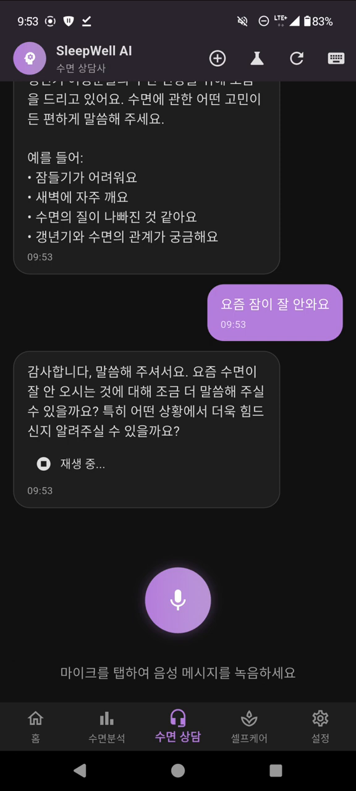
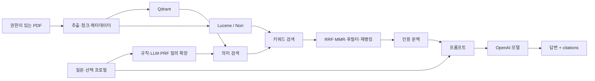

# RAG 기반 개인 맞춤형 수면 상담 챗봇

수면 관련 질문에 전문 문헌을 검색해 연결하고, 근거와 함께 답변을 제공하는 팀 프로젝트입니다. **내 역할은 RAG 모델 구축과 검색·재랭킹 실험**이며, 전체 백엔드와 모바일 앱은 팀 결과물입니다. Project name: RESTDAWN / SleepWell.

| 항목 | 내용 |
|---|---|
| 해결한 문제 | 일반적인 수면 조언을 사용자 질문·프로필·문헌 근거에 연결 |
| 핵심 기술 | Java 17 · Spring Boot 3.5.0 · Spring AI 1.0.3 · Qdrant · Lucene/Nori |
| 핵심 구현 | 문서 이중 색인 → 질의 확장 → 의미/키워드 검색 → RRF/MMR → 인용·답변 |
| 현재 검증 | 백엔드 컴파일·실행 JAR 생성, 외부 호출 없는 Java 계약 테스트 6개 통과 |
| 역사적 결과 | 보고서 context recall 0.833, E2E faithfulness 0.823. 원평가 재현 미완료 |
| 대표 자료 | 모바일 음성상담 실제 시연, 현재 서비스 소스와 별도 병렬 실험 원자료 |

[아키텍처](docs/architecture.md) · [실행·검증](docs/reproducibility.md) · [실험·한계](docs/experiments.md) · [검색 지연 분석](docs/performance.md)

<a href="assets/mobile-consultation-demo.mp4"></a>

*실제 모바일 음성상담 시연입니다. 이 화면만으로 RAG 검색 품질이나 특정 백엔드 커밋과의 일치를 입증하지는 않습니다.* [50초 영상](assets/mobile-consultation-demo.mp4) · [시연 범위](docs/demo.md)

## Overview / Problem

수면 상담에서 일반 LLM의 답변만으로는 어떤 문헌을 근거로 하는지 확인하기 어렵습니다. 이 프로젝트는 수면 관련 문서를 먼저 찾고 그 문맥으로 답변을 구성하도록 설계했습니다. 질문과 프로필을 연결하지만, 본 프로젝트는 연구·교육 목적의 프로토타입이며 의료 진단을 대체하지 않습니다.

## Solution / Key Features

- **의미 검색:** “잠에 쉽게 들지 못함”과 “불면증”처럼 표현이 달라도 가까운 문서를 찾기 위해 임베딩과 Qdrant를 사용합니다. 예시는 검색 의도를 설명하며 해당 문구의 실제 검색 성공을 보장하지 않습니다.
- **키워드 검색:** 문서의 제목·본문에 직접 나타나는 단어를 Lucene BM25/Nori로 검색합니다.
- **결과 결합:** 두 검색 결과의 순위를 RRF로 합치고, Jaccard 기반 MMR과 규칙 기반 재랭킹으로 후보를 정리합니다. 학습한 cross-encoder를 사용한 것으로 표현하지 않습니다.
- **근거 제공:** 선택한 문헌의 제목·URL·발췌를 프롬프트에 담고 답변과 citations를 반환합니다.
- **데이터 처리:** PDF 추출, 문자 청크, 메타데이터 정규화, Lucene/Qdrant 배치 색인이 실제 코드에 있습니다.

## Architecture / Data Flow



현재 서비스 소스의 Dense/Sparse 호출은 **순차**입니다. 과거 개인 실험 브랜치의 `CompletableFuture` 병렬 전략은 [RAG Retrieval Benchmark](https://github.com/YIM551/rag-retrieval-benchmark)에서 별도로 보존합니다. [버전별 구조와 코드 링크](docs/architecture.md)를 확인하세요.

## My Contribution

캡스톤 보고서 역할표는 RAG 모델 구축을 개인 역할로 기록하고, 추진 계획에는 Qdrant·Lucene·Hybrid Search·MMR/RBF 관련 작업을 연결합니다. 로컬 실험 브랜치와 분석 코드도 확보했습니다. 역할표·브랜치 존재는 모든 팀 파일의 단독 작성 증거가 아니므로 백엔드의 인증·결제·알림·전체 모바일 구현을 개인 성과로 주장하지 않습니다.

2026년 포트폴리오 정리에서는 원본 소스를 보존하면서 Dense 검색 연결, 입력 검증, 일부 민감한 로그, 비활성 캐시 설명, 안전한 설정 및 테스트를 보완했습니다. [수정 목록과 출처 해시](docs/review-followup.md)를 별도로 기록했습니다.

## Dataset / Implementation

로컬 코퍼스에서 수면 문헌·서적 PDF 16개를 확인했습니다. 이는 폴더의 파일 수이며 실제 평가 실행 당시의 색인 문서·청크 수와 동일하다고 단정하지 않습니다. 라이선스가 확인되지 않은 원문과 인덱스는 배포하지 않습니다. [데이터 출처·처리 흐름](docs/dataset.md) · [코퍼스 manifest](docs/corpus-manifest.json)

현재 `rag` 설정은 embedding `text-embedding-3-large`, dense top-k 30, sparse 60, RRF 60, MMR 25/lambda 0.45, rerank 20, 최종 요청 top-k 기본 5, 문자 chunk 1200/overlap 200입니다. [숫자와 근거 파일](docs/key-numbers.md)

주요 구현:

- [질의 파이프라인](backend/src/main/java/com/sleepwell/sleepwell_backend/rag/service/RagQueryService.java)
- [문서 이중 색인](backend/src/main/java/com/sleepwell/sleepwell_backend/rag/service/RagIndexService.java)
- [Qdrant 검색 어댑터](backend/src/main/java/com/sleepwell/sleepwell_backend/rag/infra/adapter/DenseAdapter.java)
- [Lucene 색인·검색](backend/src/main/java/com/sleepwell/sleepwell_backend/rag/infra/SparseStore.java)
- [RRF·MMR](backend/src/main/java/com/sleepwell/sleepwell_backend/rag/infra/impl/ScoringUtils.java)

## Experiments / Results

| 근거 | 확인한 결과 | 해석 범위 |
|---|---|---|
| 2026 로컬 검증 | Java 6개 계약 테스트, Python 3개 분석기 테스트 통과; bootJar 생성 | 테스트 대역·코드 계약; 운영 E2E 아님 |
| 캡스톤 보고서 | retrieval-only recall 0.833 / precision 0.796; E2E faithfulness 0.823 | 원평가 설정·질의·출력을 같은 실행으로 재현하지 못한 보고서 수치 |
| 별도 병렬 실험 | 과거 원로그/요청별 timing/CSV와 분석 코드 복구 | [실험 저장소](https://github.com/YIM551/rag-retrieval-benchmark)의 실행별 조건·지표 참고 |
| Fine-tuning | Stage3 config의 Mistral-7B-Instruct-v0.3 확인 | 학습 완료·서비스 배포와 구분. [상세](docs/fine-tuning.md) |

질의 응답의 품질, 지연, 동시 사용자는 서로 다른 평가 대상입니다. 보고서의 28명 설문과 부하 테스트 수치는 원자료 한계가 있어 서비스 동시 사용자 성능으로 사용하지 않습니다. [상세 해석](docs/experiments.md)

## Demo

[실제 모바일 상담 영상](assets/mobile-consultation-demo.mp4)은 녹음, 전사된 질문, 상담 답변과 재생 UI를 보여줍니다. 2026년에 새로 만든 실행 영상이 아니며, 현재 로컬 테스트와 분리해 제시합니다. [시연 설명](docs/demo.md)

## Getting Started

JDK 17이 필요합니다. Gradle wrapper와 의존성은 처음 실행할 때 다운로드될 수 있습니다. 아래 검증은 애플리케이션 서버나 외부 API를 시작하지 않습니다.

```bash
git clone https://github.com/YIM551/rag-sleep-assistant.git
cd rag-sleep-assistant/backend
# Windows PowerShell
.\gradlew.bat test bootJar --no-daemon
# macOS/Linux: chmod +x gradlew && ./gradlew test bootJar --no-daemon
```

저장소 루트에서 Python 표준 라이브러리 분석기 검사:

```bash
python -m unittest discover -s tests -v
python scripts/benchmark_retrieval.py
```

두 번째 명령은 기본 dry-run입니다. 서비스 기동에는 외부 모델·Qdrant·인증·연동 설정이 추가로 필요하며 통합 실행은 아직 검증하지 않았습니다. [재현 조건](docs/reproducibility.md) · [안전한 로컬 부하 시나리오](tests/load/README.md)

## Project Structure

```text
backend/                  현재 팀 백엔드 Java 소스·Gradle·RAG 설정·회귀 테스트
legacy/streamlit-prototype 초기 Python/Pinecone 프로토타입
assets/                   검토한 실제 모바일 시연 영상·화면
scripts/                  단계별 timing 로그 오프라인 분석기
tests/                    분석기 테스트·로컬 k6 시나리오
docs/                     아키텍처·데이터·실험·재현·출처 manifest
```

## Technical Challenges

초기 Pinecone/Python 프로토타입과 Java 서비스 통합본은 서로 다른 코드입니다. 현재 소스에서 임베딩 클라이언트와 검색 저장소를 혼동한 Dense 연결 오류를 찾아 typed VectorStore 계약으로 수정하고, 실제 Spring AI 1.0.3 API를 사용하는 테스트로 확인했습니다. 문자 청크 종료·재구성 경계, 원문 로그, 순위 결합과 후필터의 역할을 코드 수준에서 분리했습니다.

병렬 실험은 I/O 대기와 스레드 전략을 분석하는 별도 작업으로 연결합니다. Docker·Gradle·프로필·서버 로그 흔적은 존재하지만 전체 운영 경험을 개인이 단독 구현한 것으로 표시하지 않습니다.

## Limitations / Future Work

- 실제 Qdrant/OpenAI 통합·Docker 이미지 실행·서비스 동시 사용자 검증은 남아 있습니다. 빌드 통과와 운영 안정성은 다릅니다.
- 저장소 간 문서 ID 정렬, namespace 격리, 부분 실패와 원자적 갱신은 후속 검증 대상입니다. 현재 RRF는 ID를 기준으로 합칩니다.
- 의료 품질·안전성, 원설문·RAGAS의 재현, 개인정보 보관·삭제 정책은 별도 검토가 필요합니다. 질문·프로필은 서버에서 외부 모델로 전송될 수 있습니다.

다음 단계는 재배포 가능한 작은 코퍼스와 평가 질문 고정 → 저장소 통합 테스트 → 동일 조건의 품질·지연 측정입니다.

## References

- RESTDAWN 캡스톤 결과보고서(2025), 역할표 인쇄 p.19, 평가 pp.35–37. 원본의 팀원 개인정보 때문에 파일 자체는 미공개.
- [원본 소스 출처 manifest](docs/source-manifest.json), 현재 snapshot `004ad3a`, 실험 snapshot `317a928`.
- [Fine-tuning 실험 저장소](https://github.com/YIM551/sleep-llm-finetuning), [검색 병렬화·데이터 처리 실험](https://github.com/YIM551/rag-retrieval-benchmark).
