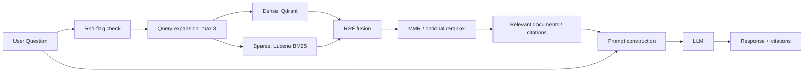

# RAG Sleep Assistant

수면 관련 문서의 의미 검색과 키워드 검색을 결합하고, 검색한 근거를 LLM 프롬프트에 전달하는 RESTDAWN RAG 모듈의 포트폴리오 사례 연구입니다.

**개인 기여: RAG 모델 구축·Qdrant/Lucene 하이브리드 검색·재랭킹.** 전체 백엔드는 팀 프로젝트이며, 이 저장소는 공개 권한이 확인되지 않은 팀 소스 대신 구현 분석과 개인 기여를 정리합니다.

## Project Overview

일반적인 수면 조언에 외부 문헌 근거를 연결하는 것이 목표입니다. 제출 소스에서 문서 색인, 질의 확장, Dense/Sparse 검색, RRF 병합, 다양성 재랭킹, 인용 문맥 구성, LLM 호출을 확인했습니다. 실제 서비스의 치료 효과를 검증한 프로젝트로 주장하지 않습니다.

## Recruiter Snapshot

| 항목 | 내용 |
| --- | --- |
| 프로젝트 유형 | 2인 캡스톤 팀 프로젝트의 RAG 모듈 |
| 역할 | 보고서 역할표: RAG 모델 구축. 추진 계획표: Qdrant·Lucene·Hybrid Search, MMR/RBF 재랭킹 |
| 기술 | Java 17, Spring Boot 3.5.0, Spring AI 1.0.3, Qdrant, Lucene 9.9.1/Nori, Apache Tika |
| 데이터 | 수면 관련 PDF/문서. 본문 및 색인 데이터는 미공개 |
| 핵심 구현 | 질의 확장 → Dense/Sparse 검색 → RRF → 선택적 MMR/재랭킹 → 인용 문맥 → LLM |
| 결과 | 제출 코드 확인 및 보고서의 탐색적 평가. 현재 환경에서 E2E 재실행 미완료 |

## Architecture



화살표의 분기는 논리적 데이터 흐름입니다. 제출본 `HybridRetriever.search`는 Dense와 Sparse를 순서대로 호출합니다. 별도 병렬화 실험은 [RAG Retrieval Benchmark](https://github.com/YIM551/rag-retrieval-benchmark)와 구분합니다.

## Tech Stack

RAG 구현은 Java/Spring AI, Qdrant 의미 검색, Lucene BM25/Nori 키워드 검색, Tika 문서 추출을 사용합니다. 전체 서비스에는 MySQL과 인증·상담 API가 있지만 개인이 전부 작성한 것으로 표시하지 않습니다. Flutter는 보고서의 클라이언트 구성이고 이 자료에는 프론트엔드 소스가 없습니다.

## Key Features

- 질의 표현 차이 → 최대 3개 질의 확장과 Dense/Sparse 결합 → 여러 검색 후보 확보. 검색 품질 개선 폭은 별도 재검증 필요.
- 중복된 근거 → 문서 ID/내용·출처 기반 중복 제거와 MMR → 제한된 문맥의 다양성 제어.
- 근거 없는 일반 응답 → 문헌 스니펫·출처를 프롬프트에 전달 → 답변과 인용 목록 반환.
- 위험 표현 → 입력의 red-flag 검사 → 지정된 안내 문구로 조기 반환. 의료 안전성 보증은 아님.

## How It Works

`RagQueryService.answer`가 입력 검사 후 `retrieveWithFilters`를 호출합니다. 요청 top-k 기본값은 5이고, 코드 주입 기본값은 Dense/Sparse 각각 60, MMR 25, lambda 0.45, rerank 20입니다. 실제 활성 설정은 설정 파일과 환경 변수에 따라 달라집니다. 키워드·namespace 필터와 중복 제거를 거쳐 인용 문맥을 구성하고 `PromptBuilder` 및 `RagChatClient`에 전달합니다. 상세 답변의 첫 두 문장을 잘라 간단 답변을 만들므로 요약용 LLM 호출은 추가하지 않습니다.

문서 색인과 질의 처리는 [구현 근거 및 한계](docs/implementation-evidence.md)에 따로 정리했습니다.

## My Contribution

캡스톤 결과보고서 인쇄 p.19의 역할표는 임나경의 역할을 **RAG 모델 구축**으로 명시합니다. 같은 페이지 추진 계획에는 Qdrant Vector DB, Lucene Nori, Hybrid Search, MMR/RBF 재랭킹이 배정되어 있습니다. 계획표는 개별 파일의 작성자 증명은 아니므로, 모든 RAG 파일의 단독 작성이나 전체 백엔드·인프라 구축을 개인 성과로 단정하지 않습니다.

## Results

보고서 인쇄 pp.35–37은 RAGAS 단계별 평가를 기록합니다. Retrieval-only context recall 0.833, context precision 0.796, E2E faithfulness 0.823이 보고되어 있습니다. **원시 평가 데이터·실행 설정을 확보하지 못했으므로 보고서 수치이며 재현 검증된 성능이 아닙니다.** 서로 다른 단계의 수치를 동일 조건의 개선율로 환산하지 않았습니다.

28명 A/B 평가도 보고되지만 본문의 선택 인원은 12명+15명=27명으로 남은 1명의 처리 확인이 필요합니다. 이를 사용자 수나 확정적 우월성으로 제시하지 않습니다.

## Getting Started

현재 공개본은 문서 사례 연구로, 서비스 실행 패키지가 아닙니다.

```bash
git clone https://github.com/YIM551/rag-sleep-assistant.git
cd rag-sleep-assistant
```

원본 실행에는 JDK 17, Gradle wrapper, MySQL/Qdrant 및 외부 API 설정이 필요합니다. 팀 소스 공개 허용, 누락 환경 설정 정리, 아래 색인 오류 수정 후 실제 빌드 및 E2E 검증을 진행해야 합니다. 실행 가능하다고 오해할 수 있는 불완전한 설치 명령은 제공하지 않습니다.

## Project Structure

```text
README.md
docs/implementation-evidence.md
docs/publication-notes.md
docs/repository-metadata.json
```

## Technical Challenges

초기 발표자료는 Streamlit/Pinecone에서 Spring AI/Qdrant로의 전환을 설명합니다. Python/Java 운영 분리 문제 → Java 백엔드 통합 방향으로 변경한 배경은 문서에 있지만, 이전 프로토타입 소스와 전환 성능 실험은 미확보입니다. 현재 소스의 URL 이중 인코딩 방어, 검색 결과 중복 제거, 인용 URL 정리는 구체적인 구현 근거로 제시할 수 있습니다.

## Limitations

- 팀 코드의 개인 저장소 재배포 동의 확인 필요. 원본 소스는 공개본에서 제외했습니다.
- `RagIndexService.simpleChunks`는 마지막 청크 뒤 종료 조건이 없어 비어 있지 않은 입력에서 무한 반복 가능성이 있습니다.
- 레거시 `index`는 청크 임베딩을 계산하지만 저장 문서에는 전체 원문을 전달합니다. 주석과 실제 동작을 구분해야 합니다.
- `indexFiles`는 주석과 달리 확인된 본문에서 SparseStore만 호출합니다. Qdrant와 Lucene의 일관된 갱신은 검증 필요입니다.
- 검색 품질, 지연, 안전성은 별도 평가 축입니다. 작은 탐색적 실험을 상용 검증으로 확대 해석하지 않습니다.

## Future Work

소스 공개 권한 확보 → 색인 종료/일관성 오류 수정과 회귀 검증 → 라이선스가 명확한 샘플 문서와 평가 질의 공개 → 품질·지연을 함께 측정하는 순서로 개선합니다.

## References

- RESTDAWN 캡스톤 결과보고서, 2025-11-21 제출본, 인쇄 pp.19, 35–37. 개인정보 포함 원본 미공개.
- 제출 소스 `rag/service/RagQueryService.java`, `rag/service/RagIndexService.java`, `rag/infra/SparseStore.java`, `rag/infra/impl/HybridRetriever.java`.
- 초기 전환 발표자료 `answer (1).pptx`. 제3자 자료와 팀 원문은 공개본에서 제외.
