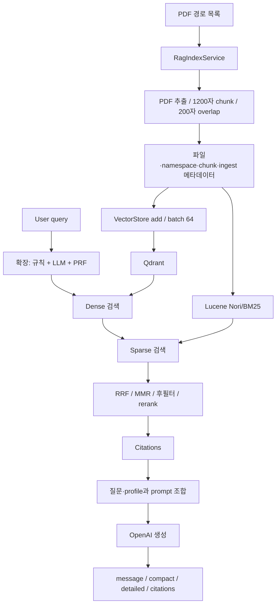

# 실제 코드 기준 아키텍처

현재 서비스 snapshot은 `004ad3a7df08f83968bfe11b01d52713151163dd`이며, 2026 수정은 [변경 기록](review-followup.md)에 명시했습니다. 아래 표의 경로는 `backend/src/main/java/com/sleepwell/sleepwell_backend/` 기준입니다.

| 단계 | 코드 | 실제 처리 |
|---|---|---|
| API | rag/controller/RagController.java | POST /api/v1/rag/query → answer |
| 입력 | rag/service/RagQueryService.java | 2026 query 길이/공백/top-k 검증, red flag, URL decoding |
| 확장 | RagQueryService + rag/infra/impl/MultiQueryExpander.java | 규칙·LLM rewrite·PRF. 최대 3개 검색 질의 |
| Dense | rag/infra/adapter/DenseAdapter.java | 2026 typed VectorStore.similaritySearch, 실제 OpenAI embedding은 외부 호출 |
| Sparse | rag/infra/SparseStore.java | Nori·BM25, title/text 검색 |
| 결합 | rag/infra/impl/HybridRetriever.java | Dense 다음 Sparse를 순차 호출; normalize → RRF → 선택적 MMR |
| 후보 정리 | RagQueryService | namespace 후필터, keyword fallback, 중복 제거, 추가 MMR, rerank |
| 재랭킹 | rag/infra/adapter/RerankerAdapter.java | 0.7 base + 0.2 lexical + 0.1 evidence/domain 규칙 점수 |
| 문맥 | rag/infra/impl/ClinicalRagPromptBuilder.java | 질문·선택 profile·인용 title/URL/quote |
| 생성 | rag/infra/SpringAiChatClient.java | openAiChatModel, 답변 + citations; 간단 답변은 첫 두 문장 |

## 버전 구분

| 자료 | 저장 위치 | 구분 |
|---|---|---|
| 초기 Streamlit | ../legacy/streamlit-prototype | Pinecone/MiniLM/GPT-4, 누락 환경과 미검증 UI 존재 |
| 현재 Java | ../backend | 팀 통합 서비스, 순차 검색 |
| 개인 병렬 실험 | [별도 repository](https://github.com/YIM551/rag-retrieval-benchmark) | v3 RagQueryService executor/CompletableFuture 전략·요청별 원로그 |
| Fine-tuning | [별도 repository](https://github.com/YIM551/sleep-llm-finetuning) | Stage별 학습 설정·평가; 현재 API에 adapter 연결 증거 없음 |

현재 DenseAdapter의 연결 오류는 2026 수정 대상입니다. 과거 v3 실험 로그에 Dense 결과가 기록되어 있다는 사실과 모순되지 않습니다. branch가 서로 다릅니다. RRF는 `ScoredDoc.id()`를 결합 키로 쓰므로 두 저장소에 같은 문서의 ID가 일치하는지 확인해야 합니다. namespace 후필터는 저장소 단계 필터가 아니어서 후보 감소를 일으킬 수 있습니다.

`PdfIngestService`는 별도 TokenTextSplitter 경로입니다. 해당 생성자 인자에 달린 과거 주석을 문자 overlap 설정과 혼동하지 않습니다. 공용 문서 색인 경로는 [RagIndexService](../backend/src/main/java/com/sleepwell/sleepwell_backend/rag/service/RagIndexService.java), 검색 구현은 [RagQueryService](../backend/src/main/java/com/sleepwell/sleepwell_backend/rag/service/RagQueryService.java)를 기준으로 읽습니다.
