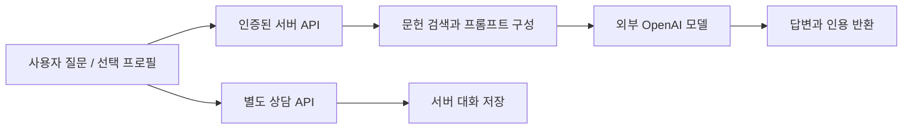

# 구현 재검토: 설명과 실행 증거의 경계

검토일: 2026-09-09. 이 문서는 제출된 팀 소스를 읽어 확인한 결과입니다. 팀 소스 공개 동의는 확인되지 않았으며, 수정한 private 사본과 원본 면접 기록은 이 저장소에 포함하지 않습니다.

## 문제와 기술 선택

프로젝트 목표는 수면 관련 질문에 관련 문헌을 찾아 일반 정보 답변의 근거로 제공하는 것입니다. 진료 대기 시간·진료비·의료 효과가 실제로 개선되었다는 비교 실험은 없습니다. 접근성을 높이고 근거를 표시하려는 개발 목표와 검증된 성과를 구분합니다.

의미 검색은 표현이 달라도 유사한 내용을 찾기 위한 선택이고, Lucene BM25/Nori는 한국어 키워드 일치를 보완하기 위한 선택입니다. RRF는 두 순위 목록을 합치고, MMR는 문맥의 중복을 줄이며, 후속 재랭킹은 후보의 순서를 다시 정합니다. `RerankerAdapter`의 RBF는 코드에 적힌 자체 명칭 Relevance Boost Fusion입니다. 학습한 Radial Basis Function 모델로 설명하지 않습니다. 각각의 검색 방식이 성능에 기여한 정도는 정상 동작하는 Dense 경로와 고정 평가셋을 갖추어 다시 측정해야 합니다.

## 데이터 흐름과 개인정보

`ClinicalRagPromptBuilder.build`는 프로필·질문·인용 문맥을 프롬프트에 넣습니다. `SpringAiChatClient`는 OpenAI 모델을 지정하여 호출합니다. 전체 서비스의 `ConsultationServiceImpl`에는 사용자 및 AI 메시지를 서버 repository에 저장하는 경로가 있습니다. 클라이언트 소스는 제공되지 않아 기기 저장 범위는 확인하지 못했습니다.

인증과 상담 세션 소유자 확인은 접근 통제의 일부입니다. 외부 전송과 저장이 사라진다는 뜻은 아닙니다. 로그·데이터 최소화, 보관 기간·삭제 정책, 제공자 설정과 사용자 안내는 실제 운영 환경에서 검토해야 합니다. 특정 제공자의 보관 조건을 확인 없이 단정하지 않습니다.

## 확인한 오류와 private 수정

| 항목 | 제출본 | private 수정 / 검증 |
| --- | --- | --- |
| 레거시 청크 분할 | 마지막 청크 이후에도 반복하여 메모리 사용이 계속 증가 | 마지막 청크에서 종료; 크기·겹침 범위 검사 |
| 레거시 벡터 색인 | 청크 임베딩을 별도 계산하지만 버리고, 전체 원문을 청크 수만큼 전달 | 실제 청크를 Document로 전달; VectorStore에 임베딩 위임; 빈 배치 생략 |
| Dense 검색 | 임베딩 전용 클라이언트에서 존재하지 않는 검색 메서드를 찾고 빈 목록 반환 | reflection을 제거하고 VectorStore.similaritySearch를 직접 호출; 실패를 빈 검색 결과로 숨기지 않음 |
| 질의 로그 | 질문·확장 질의·키워드 일부를 로그에 기록 | 해당 RAG 경로는 길이·개수·오류 종류로 변경 |
| Docker 빌드 wrapper | Dockerfile에서 복사하지 않은 `./gradlew`를 실행 | 실제 제출 wrapper를 `./gradlew`로 복사하고 wrapper JAR·설정 전체를 포함, 실행 권한 부여; 의존성 단계도 동일 wrapper 사용 |

Spring AI 1.0.3의 Qdrant 구현은 `doAdd`에서 Document들의 임베딩을 계산하고 저장합니다. 이 동작을 확인하여 중복된 수동 임베딩 호출을 제거했습니다. [Spring AI 1.0.3 QdrantVectorStore 소스](https://github.com/spring-projects/spring-ai/blob/v1.0.3/vector-stores/spring-ai-qdrant-store/src/main/java/org/springframework/ai/vectorstore/qdrant/QdrantVectorStore.java)

로그 수정은 특정 RAG 경로의 직접적인 질의 로깅을 줄인 것입니다. 전체 앱·라이브러리·외부 서비스의 모든 민감정보 로깅을 제거했다고 주장하지 않습니다. 질의와 프로필의 모델 전송 자체는 현재 기능의 일부입니다.

## 실제 수행한 검증

- Java 17에서 원본 청크 메서드를 추출하여 실행: 짧은 입력에서 `OutOfMemoryError`를 재현했습니다(힙 상한 64MB).
- 수정된 실제 `index`·`simpleChunks` 메서드를 추출한 로컬 테스트: 8개 경계 사례, 4,500개 길이·크기·겹침 조합의 원문 재구성, 저장소에 전달한 청크 내용, 빈 배치 생략, 저장 실패 전파를 통과했습니다. Spring 객체는 이 테스트에서 로컬 대역입니다.
- 수정 `DenseAdapter`와 원본 `ScoredDoc`·`DenseRetrieverPort`를 실제 Spring AI 1.0.3 API JAR로 컴파일했습니다. 로컬 VectorStore 대역으로 질의/top-k 전달, ID·본문·점수·메타데이터 보존, 빈 결과, 잘못된 입력, 실패 전파를 검증했습니다.
- 개인정보 로그 변경은 diff와 로그 호출을 정적으로 확인했습니다. 전체 컨트롤러/서비스 빌드 성공으로 기록하지 않습니다.
- private patch 3개를 LF로 저장하고 별도 원본 사본에서 기본 `git apply --check`를 각각 통과했습니다. 실제 적용 후 수정 사본과 텍스트가 일치하는 것도 확인했습니다.
- Dockerfile의 각 COPY 원본, wrapper LF 형식과 JAR·설정 파일 존재를 확인했습니다. Docker CLI는 있으나 Linux 엔진 파이프에 연결할 수 없어 이미지 빌드는 실행하지 못했습니다.

private 테스트는 새로 만든 2026년 회귀 검사입니다. 과거 배포의 정상 동작, 보고서의 검색 점수, 지연 시간 개선, 동시 사용자 처리량을 재현한 결과가 아닙니다. 공개 저장소에는 테스트 대상인 팀 소스가 없으므로 이 검사를 독립 실행할 수 없습니다.

## 남은 문제

| 우선순위 | 확인 내용 | 필요한 증거 / 다음 작업 |
| --- | --- | --- |
| P0 | 파일 색인은 Lucene만 갱신하지만 주석은 두 저장소를 갱신한다고 설명 | Qdrant/Lucene 동시 갱신과 실패 복구, 동일 문서 ID 정책 |
| P0 | private Dockerfile의 wrapper 복사·이름 처리는 수정했으나 이미지 미검증 | Docker 엔진을 사용할 수 있는 환경에서 실제 이미지 빌드·앱 시작 검사 |
| P0 | Dense 연결 수정의 실제 통합 동작 미검증 | 동일 임베딩 모델/차원과 Qdrant collection을 확인한 후 검색 회귀 검사 |
| P1 | 레거시 인덱싱은 namespace·overwrite·출처 메타데이터를 충분히 반영하지 않음 | 재색인 시 중복 방지·필터·인용까지 연결하여 검증 |
| P1 | private Cacheable 메서드의 내부 호출 | 캐시가 실제 적용되는지 확인; 주석의 시간 절감 수치를 실측으로 사용하지 않기 |
| P1 | 인용 목록은 검색 문헌 목록이고 생성된 각 주장과의 일치 검증은 없음 | 근거 없는 답변·인용 오류·자료 없음 사례 평가 |
| P1 | 실제 동시 접속·처리량 자료 없음 | 사용자 수, 동시 요청 수, 성공률, p95 지연, 완료 처리량을 구분해 측정 |
| P2 | 상태 API의 임베딩 차원 값과 프로필 설정의 모델/차원이 다름 | 활성 설정과 실제 collection을 읽어 상태 응답 구성 |

전체 백엔드 운영·배포가 개인 기여였다는 근거는 없습니다. 보고서의 개인 역할은 RAG 모델 구축이며, 검색 구조·프롬프트·디버깅 경험과 팀의 서버 운영 책임을 구분하여 설명합니다.
